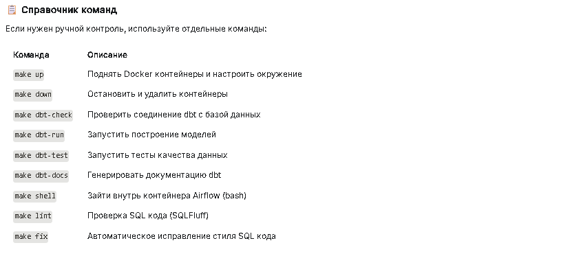

# ❄️ dbt + Airflow Data Vault Project


Проект по построению корпоративного хранилища данных (DWH) с использованием методологии **Data Vault 2.0**, оркестрацией через **Apache Airflow** и трансформациями на **dbt** (Data Build Tool) в облаке **Snowflake**.

---

## 🏗 Архитектура и Моделирование

Проект реализует полный цикл ELT процесса, преобразуя сырые данные из `SNOWFLAKE_SAMPLE_DATA` в аналитические витрины.

### 🔄 Data Flow (Поток данных)

1.  **Sources (Stage):** Загрузка данных из `SNOWFLAKE_SAMPLE_DATA` (TPCH/TPCDS).
2.  **Raw Vault:**
   *   **Hubs:** Бизнес-ключи (Customer, Order, etc.).
   *   **Links:** Связи между сущностями (строго 2 сущности на линк).
   *   **Satellites:** Атрибуты и контекст.
      *   *Optimization:* Разделение сателлитов на **High Velocity** (часто меняющиеся данные) и **Low Velocity** (редко меняющиеся) для оптимизации хранения.
      *   *Effectivity Satellites:* Отслеживание истории изменений связей (Driver keys).
3.  **Business Vault:**
   *   Внедрение бизнес-правил.
   *   **PIT (Point-in-Time) tables:** Для ускорения джойнов при построении витрин.
   *   **Bridge tables:** Для упрощения связей "многие-ко-многим".
   *   Обогащение данных через внешние Seed-файлы (Master Data).
4.  **Data Marts (Star Schema):**
   *   Финальные витрины для отчетности.
   *   **Facts:** Транзакционные данные.
   *   **Dimensions:** Измерения (Dim_Date, Dim_Customer).

---

# 📂 Структура проекта

```

├ dbt_airflow_task
│
├── core/
├── .github/                   # CI/CD Workflows
├── core/
│   ├── airflow/               # DAGs и конфигурация Airflow
│   └── dbt_customer_project/  # Основной dbt проект
│       ├── models/
│       │   ├── stage/         # View
│       │   ├── raw_vault/     # Hubs, Links, Satellites
│       │   ├── business_vault/ # PITs, Computed Sats
│       │   └── marts/         # Fact & Dimensions
│       ├── seeds/             # CSV файлы для Master Data
├── utils/                     # Python скрипты (Telegram alerts, Snowflake config)
├── Makefile                   # Единая точка входа для управления проектом
```



