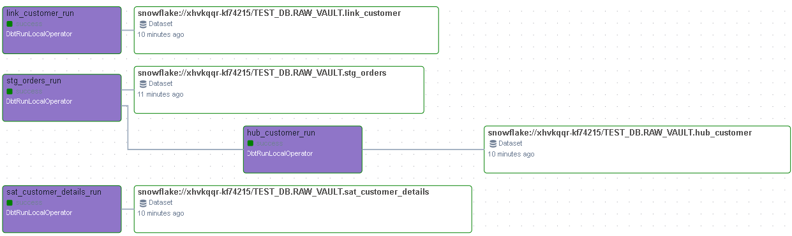

🚀 [Dbt Airflow Mono Repo]
Этот монорепозиторий объединяет сервисы оркестрации (Apache Airflow) и трансформации данных (dbt) для построения надежного и тестируемого хранилища данных (Data Warehouse) на базе [Ваша БД, например, Snowflake/Postgres]. Управление зависимостями Python осуществляется с помощью современного инструмента uv и декларативного файла pyproject.toml.

🌟 Ключевые Технологии (Tech Stack)
Оркестрация: Apache Airflow

Трансформация (ELT): dbt (data build tool)

Интеграция dbt: Astronomer Cosmos

Контейнеризация: Docker / Docker Compose

Зависимости: uv и pyproject.toml

Качество Кода: Ruff (линтер), Black (форматер), sqlfluff (линтер SQL)

```
dbt_airflow_task/
├── .github/workflows/         # Конфигурация CI/CD (GitHub Actions)
│   └── ci-pipeline.yml        # Пайплайн для линтинга, форматирования и dbt-debug
├── .venv/                     # Виртуальное окружение Python (игнорируется git)
├── airflow/                   # Основная рабочая директория Airflow
│   ├── dags/                  # Все DAG-файлы Airflow (монтируются в контейнер)
│   └── logs/                  # Логи Airflow (игнорируются git)
├── dbt_project/               # Корневая директория dbt-проекта
│   └── models/                # SQL-модели данных
├── libs/                      # Локальные Python-пакеты, модули и утилиты
├── .dockerignore              # Файлы, исключаемые из образа Docker
├── .env                       # Переменные окружения для Docker Compose
├── .gitignore                 # Файлы, исключаемые из Git
├── consts.py                  # Общие константы проекта
├── Dockerfile                 # Кастомный образ Airflow для контейнеризации
├── docker-compose.yml         # Конфигурация запуска сервисов
├── pyproject.toml             # Управление зависимостями Python (uv)
├── uv.lock                    # Файл блокировки зависимостей (для воспроизводимости)
└── [Прочие файлы: LICENSE, Makefile, TODO, README.md]

```

⚙️ Локальный Запуск (Development Setup)

1. Предварительные требования
   Docker Desktop (запущен)

2. Запуск Сервисов

docker-compose up -d --build

3. Настройка Airflow
   
Доступ: Откройте веб-интерфейс Airflow по адресу: http://localhost:8080.

Аутентификация: Используйте учетные данные администратора, заданные в вашем файле .env или по умолчанию (admin/admin).

Создание Connection для dbt: Для того чтобы Airflow мог запустить dbt-модели через Cosmos, необходимо настроить подключение в Airflow UI:

Перейдите в Admin -> Connections.

Создайте новое подключение.

Conn Id (Обязательно): [snowflake_default] (Должно совпадать с ID, используемым в DAG).

Conn Type: Выберите соответствующий тип базы данных (например, Snowflake или Postgres).

Заполните все необходимые учетные данные и параметры схемы/склада/роли.

4. Разработка
   Все изменения в исходных файлах (airflow/dags, dbt_project/, libs/) автоматически синхронизируются с запущенными контейнерами благодаря монтированию томов в docker-compose.yml.

РЕЗУЛЬТАТЫ ВЫПОЛНЕНИЯ:


